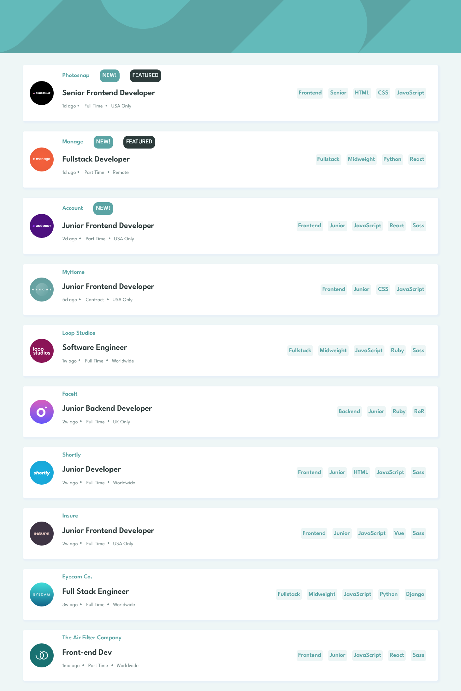
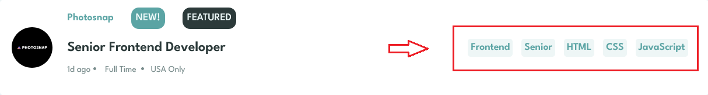

# Frontend Mentor - Job listings with filtering solution

This is a solution to the [Job listings with filtering challenge on Frontend Mentor](https://www.frontendmentor.io/challenges/job-listings-with-filtering-ivstIPCt). Frontend Mentor challenges help you improve your coding skills by building realistic projects. 

## Table of contents

  - [The challenge](#the-challenge)
  - [Screenshot](#screenshot)
  - [How to use](#how-to-use)
  - [Links](#links)
  - [Built with](#built-with)
  - [What I learned](#what-i-learned)
  - [Continued development](#continued-development)
  - [Useful resources](#useful-resources)

### The challenge

Users should be able to:

- View the optimal layout for the site depending on their device's screen size
- See hover states for all interactive elements on the page
- Filter job listings based on the categories

### Screenshot

### How to use

To add a filter you only have to click in any tag in any job in the list

After that a menu with all the tags you selected will be displayed,
you can add and remove individually a tag , and automatically the filters 
will be applied, also you can remove all tags with the clear button 

### Links

- Solution URL: [solution](https://github.com/Elmomero/filters-jobs-app)
- Live Site URL: [live site URL](https://your-live-site-url.com)

### Built with

- Semantic HTML5 markup
- CSS custom properties
- Flexbox
- Mobile-first workflow
- [React](https://reactjs.org/) - JS library
- [Redux-toolkit](https://redux-toolkit.js.org/) -Js library

### What I learned

I implemented redux pattern to manage the app state between all the components.
in particular redux-toolkit. 

### Continued development

I want to make proyects like this but using typescript instead of javasript 
### Useful resources

